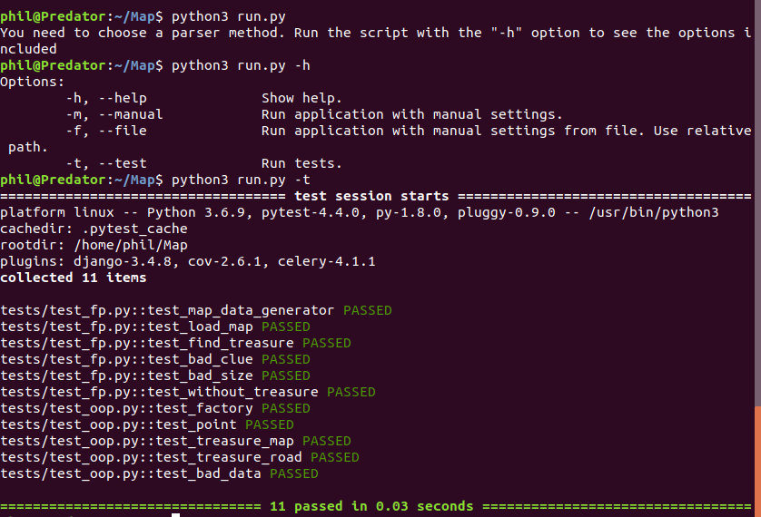
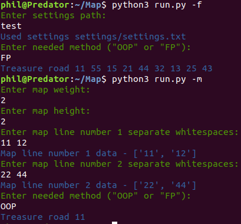
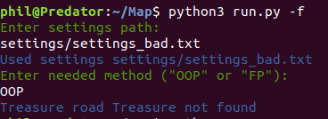
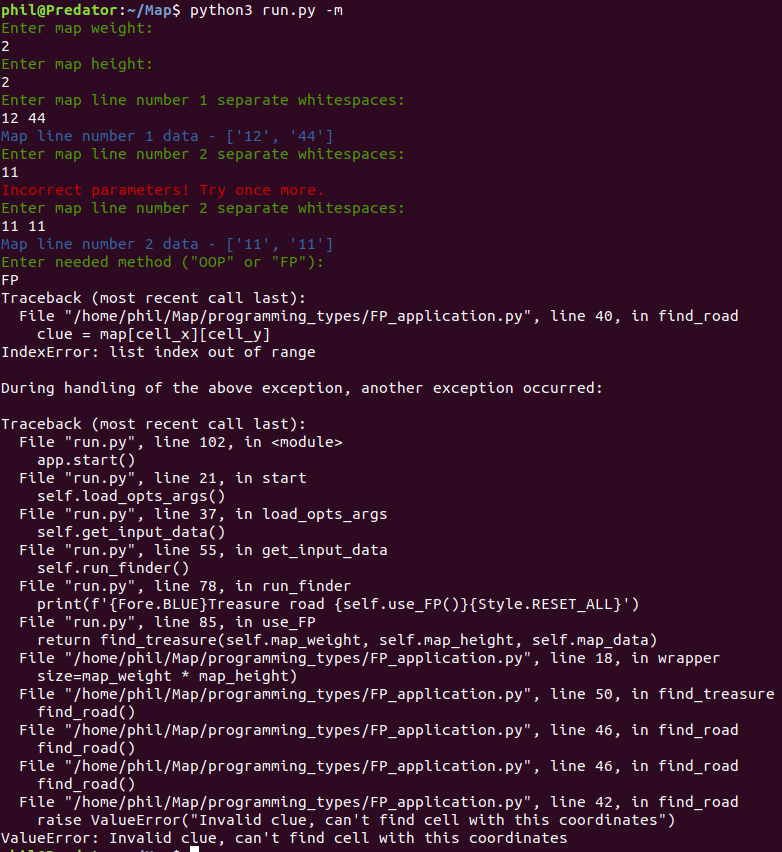

### Steps to run this application:  
* create virtual environment 
```
$: virtualenv venv
```
* activate virtual environment 
```
$: source venv/bin/activate
```
* install requirements
```
$: pip install -r requirements.txt
```
* run application in needed mode (-m, -f, -t)
```
$: python3 run.py -h
```

### Run examples
* run with `--help` or `--test`:


* run with `-f` or `-m`:


* run with bad map file:


* run with bad values:


